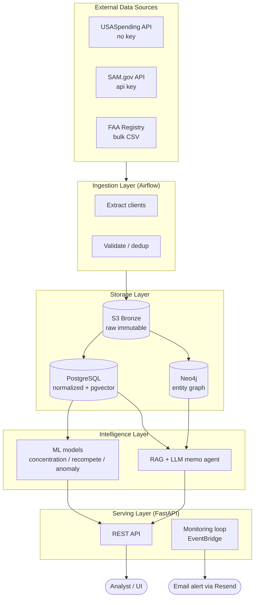
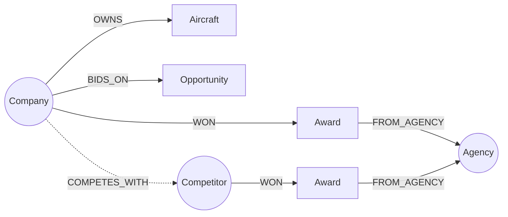
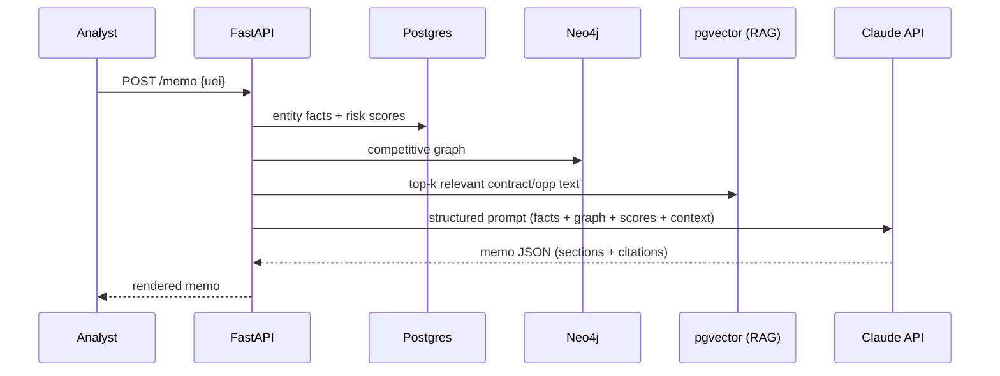
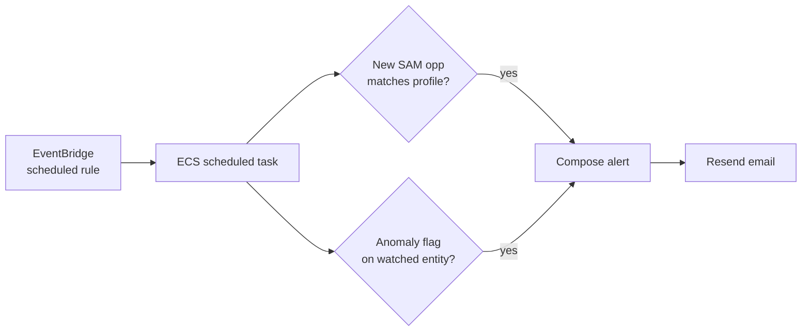
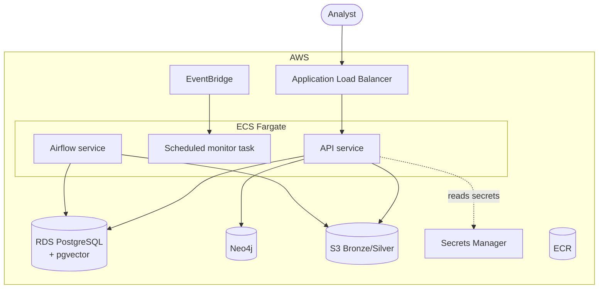

Developed a responsive React frontend consuming backend endpoints, managing the end-to-end software development life cycle through disciplined Git workflows and API contract iterations.# PoseidonGov Intelligence — Technical Architecture

**An AI/ML + MLOps deal-intelligence platform for private equity in aviation and government-contract-dependent assets.**

This document is the end-to-end technical architecture: data sources, storage, ML and LLM layers, the serving application, and the full MLOps/DevOps stack that operates it in production. It is written to be built from.

---

## 1. What the system does

A PE analyst evaluating an aviation or GovCon target needs three capabilities. This platform delivers all three from public federal data:

1. **Sourcing** — surface companies winning contracts in attractive niches (by NAICS code, agency, growth in award volume).
2. **Diligence** — score a target's risk: how concentrated is its revenue on one agency? Which contracts expire soon and are exposed to recompete? What does its fleet look like?
3. **Monitoring** — a continuously running loop that alerts when a portfolio company's competitor wins big, or a key contract goes up for recompete.

The "ops" that makes this AIOps-flavored is the monitoring loop: the system *operates* on a live stream of procurement signal the way an AIOps tool operates on infrastructure telemetry — detect, reason, alert.

### Design principles

- **Public data only.** No scraping of gated sources; everything is a documented API or bulk download.
- **Reproducible.** Raw pulls are immutable and versioned; every model and memo is traceable to the data that produced it.
- **Cloud-native but lean.** ECS Fargate over EKS — production-grade without Kubernetes overhead at this stage.
- **Eval-gated.** No model or prompt ships without passing an automated quality gate in CI.

---

## 2. High-level architecture



---

## 3. Data layer

### 3.1 Sources and access


| Source                    | Access                                                   | What it gives you                                                                      | Cadence        |
| ------------------------- | -------------------------------------------------------- | -------------------------------------------------------------------------------------- | -------------- |
| **USASpending.gov**       | Public REST,**no API key**                               | Historical contract*awards* by recipient, agency, NAICS, amount, period of performance | Refresh weekly |
| **SAM.gov Opportunities** | REST,**free API key** (1,000/day basic tier)             | Live and upcoming*solicitations*                                                       | Refresh daily  |
| **FAA Aircraft Registry** | Bulk`.zip` download (~60 MB, refreshed daily 11:30pm CT) | Registered aircraft + owner/registrant — maps fleets to companies                     | Refresh weekly |

### 3.2 Extraction clients

**USASpending — `spending_by_award` (POST, paginated, no auth):**

```python
# ingestion/clients/usaspending.py
import httpx

USA_URL = "https://api.usaspending.gov/api/v2/search/spending_by_award/"

def fetch_awards(naics_codes: list[str], start: str, end: str, page: int = 1):
    payload = {
        "filters": {
            "award_type_codes": ["A", "B", "C", "D"],   # contracts
            "naics_codes": naics_codes,
            "time_period": [{"start_date": start, "end_date": end}],
        },
        "fields": [
            "Award ID", "Recipient Name", "Recipient UEI",
            "Award Amount", "Awarding Agency", "Awarding Sub Agency",
            "NAICS Code", "Period of Performance Start Date",
            "Period of Performance Current End Date",
        ],
        "page": page,
        "limit": 100,
        "sort": "Award Amount",
        "order": "desc",
    }
    r = httpx.post(USA_URL, json=payload, timeout=60)
    r.raise_for_status()
    return r.json()
```

**SAM.gov — opportunities (GET, API key, `MM/dd/yyyy` dates):**

```python
# ingestion/clients/sam.py
import httpx, os

SAM_URL = "https://api.sam.gov/opportunities/v2/search"

def fetch_opportunities(naics: str, posted_from: str, posted_to: str):
    params = {
        "api_key": os.environ["SAM_API_KEY"],
        "postedFrom": posted_from,   # e.g. "01/01/2026"
        "postedTo": posted_to,
        "ncode": naics,
        "limit": 100,
    }
    r = httpx.get(SAM_URL, params=params, timeout=60)
    r.raise_for_status()
    return r.json()
```

**FAA — bulk registry (download, unzip, join two files):**

The `ReleasableAircraft.zip` contains `MASTER.txt` (one row per tail number, includes registrant name + `MFR MDL CODE`) and `ACFTREF.txt` (aircraft reference, keyed by `CODE`). Join `MASTER."MFR MDL CODE"` → `ACFTREF.CODE` to get make/model per registered owner. Filter `MASTER."NAME"` against your target-company list to attach fleets to entities.

### 3.3 Raw landing (Bronze)

Every pull lands in S3 **before** parsing, immutable, partitioned by source and date:

```
s3://aerogov-bronze/
  usaspending/dt=2026-06-06/awards_naics_481111_p1.json
  sam/dt=2026-06-06/opps_naics_481111.json
  faa/dt=2026-06-06/ReleasableAircraft.zip
```

This is the reproducibility backbone — you can always rebuild downstream tables from raw. (A medallion bronze/silver/gold layout; you can graduate Bronze→Silver to Delta Lake on S3 later if you want the same stack you scoped for InfraOS.)

### 3.4 Normalized schema (PostgreSQL — Silver/Gold)

```sql
CREATE TABLE entity (
    uei            TEXT PRIMARY KEY,         -- SAM Unique Entity ID
    name           TEXT NOT NULL,
    naics_primary  TEXT,
    state          TEXT,
    first_seen     DATE,
    last_seen      DATE
);

CREATE TABLE award (
    award_id       TEXT PRIMARY KEY,
    recipient_uei  TEXT REFERENCES entity(uei),
    amount         NUMERIC,
    awarding_agency TEXT,
    naics_code     TEXT,
    pop_start      DATE,
    pop_end        DATE,                      -- drives recompete risk
    ingested_at    TIMESTAMPTZ DEFAULT now()
);

CREATE TABLE opportunity (
    notice_id      TEXT PRIMARY KEY,
    title          TEXT,
    agency         TEXT,
    naics_code     TEXT,
    posted_date    DATE,
    response_deadline DATE,
    description    TEXT,
    embedding      VECTOR(1536)               -- pgvector, for RAG
);

CREATE TABLE aircraft (
    n_number       TEXT PRIMARY KEY,
    owner_name     TEXT,
    owner_uei      TEXT REFERENCES entity(uei),  -- fuzzy-matched
    make_model     TEXT,
    year_mfr       INT
);

CREATE TABLE risk_score (
    uei            TEXT REFERENCES entity(uei),
    as_of          DATE,
    hhi_agency     NUMERIC,    -- concentration
    top_customer_pct NUMERIC,
    recompete_risk NUMERIC,    -- model output 0..1
    anomaly_flag   BOOLEAN,
    PRIMARY KEY (uei, as_of)
);
```

### 3.5 Graph model (Neo4j)

The graph is what lets the LLM reason about *relationships* — competitive networks, shared agencies, fleet overlaps — that are awkward in SQL.



`COMPETES_WITH` is *derived*: two companies that win awards from the same agency in the same NAICS are competitors. One Cypher query then answers "who else fights for this target's revenue."

---

## 4. Intelligence layer

### 4.1 ML models

**(a) Revenue concentration — Herfindahl-Hirschman Index.**
A defensible, analyst-recognized metric. For a recipient, compute the share of total award dollars from each agency, square, and sum. High HHI = dangerous single-customer dependence (a core diligence red flag).

```python
def hhi_by_agency(awards: list[dict]) -> float:
    total = sum(a["amount"] for a in awards)
    if total == 0:
        return 0.0
    shares = {}
    for a in awards:
        shares[a["awarding_agency"]] = shares.get(a["awarding_agency"], 0) + a["amount"]
    return sum((v / total) ** 2 for v in shares.values())   # 0..1
```

**(b) Recompete risk — gradient-boosted classifier.**
Label: did an award lead to a follow-on with the same recipient, or did it lapse? Features: contract age, `pop_end` proximity, agency, competition type, recipient's incumbency strength. Predicts probability that an expiring contract is *lost* on recompete — the single most important risk in GovCon diligence. Train with scikit-learn / XGBoost; track in MLflow.

**(c) Award-velocity anomaly — Isolation Forest.**
Per recipient, build a monthly award-dollar time series. Flag statistically unusual spikes (possible new contract win → competitive threat) or drops (possible distress → opportunity). Cheap, unsupervised, surfaces the events the monitoring loop should alert on.

**Feature handling:** start with a `features` table in Postgres computed by a nightly Airflow DAG. Graduate to Feast if you want a feature-store talking point later. Models, params, and metrics all log to **MLflow**, with the chosen model promoted in the MLflow Model Registry.

### 4.2 LLM layer — RAG + memo agent

The LLM does not invent facts. It assembles a structured **diligence memo** from four grounded inputs:



The prompt forces structure and citation: business overview, revenue-concentration analysis (must cite the computed HHI), recompete exposure (must list the specific expiring `award_id`s), competitive position (from the graph), red flags, and a recommendation. RAG over `opportunity.description` and award text via **pgvector** (one fewer moving part than Pinecone for the MVP; swap to Pinecone later if scale demands).

### 4.3 Eval harness (the quality gate)

A golden set of ~30 entities with known characteristics. Two layers of checks, both run in CI:

- **Deterministic:** does the memo cite the correct HHI (±tolerance)? Does it list the right expiring contracts? (Pure assertions — fast, free.)
- **LLM-as-judge:** rubric-scored accuracy, completeness, and absence of hallucinated facts.

The build fails if either layer regresses below threshold. Every LLM call is traced in **Langfuse** (token cost, latency, full prompt/response).

---

## 5. Serving layer

### 5.1 FastAPI application

```
app/
  main.py                # app factory, middleware, instrumentation
  routers/
    entities.py          # GET /entities, /entities/{uei}
    risk.py              # GET /risk/{uei}
    memo.py              # POST /memo   (async, background task)
    opportunities.py     # GET /opportunities  (filtered, semantic search)
    monitor.py           # POST /monitor/subscribe
  services/
    risk_service.py
    memo_service.py
    rag_service.py
  core/
    config.py            # pydantic-settings, reads from env/Secrets Manager
    db.py                # async SQLAlchemy session
    graph.py             # Neo4j driver
```

Memo generation is long-running, so `/memo` enqueues a background task and returns a job id; the client polls or receives a webhook. For scale, replace background tasks with SQS + a worker service.

### 5.2 Monitoring loop (the AIOps core)



An EventBridge rule fires a scheduled ECS task daily. It checks (a) new opportunities semantically matching a subscribed company's profile and (b) fresh anomaly flags on watched entities, then sends a digest via Resend.

---

## 6. MLOps / DevOps stack

### 6.1 Containerization (multi-stage Docker)

```dockerfile
# --- builder ---
FROM python:3.12-slim AS builder
WORKDIR /app
COPY requirements.txt .
RUN pip install --no-cache-dir --prefix=/install -r requirements.txt

# --- runtime ---
FROM python:3.12-slim
COPY --from=builder /install /usr/local
WORKDIR /app
COPY app/ app/
EXPOSE 8000
CMD ["uvicorn", "app.main:app", "--host", "0.0.0.0", "--port", "8000"]
```

### 6.2 Infrastructure as Code (Terraform)

Provisions the whole footprint. Module layout:

```
infra/
  modules/
    network/      # VPC, subnets, security groups
    data/         # RDS Postgres, S3 buckets, Neo4j (EC2 or Aura)
    compute/      # ECR, ECS Fargate cluster + service, ALB
    scheduling/   # EventBridge rule + scheduled task
    secrets/      # Secrets Manager entries
  envs/
    dev/main.tf
    prod/main.tf
```

Representative service definition:

```hcl
resource "aws_ecs_service" "api" {
  name            = "aerogov-api"
  cluster         = aws_ecs_cluster.main.id
  task_definition = aws_ecs_task_definition.api.arn
  desired_count   = 1
  launch_type     = "FARGATE"

  network_configuration {
    subnets         = module.network.private_subnet_ids
    security_groups = [module.network.api_sg_id]
  }

  load_balancer {
    target_group_arn = aws_lb_target_group.api.arn
    container_name   = "api"
    container_port   = 8000
  }
}
```

### 6.3 CI/CD (GitHub Actions)

```yaml
# .github/workflows/deploy.yml
name: deploy
on:
  push: { branches: [main] }
jobs:
  pipeline:
    runs-on: ubuntu-latest
    steps:
      - uses: actions/checkout@v4
      - uses: actions/setup-python@v5
        with: { python-version: "3.12" }
      - run: pip install -r requirements-dev.txt

      - name: Lint
        run: ruff check .

      - name: Unit tests
        run: pytest -q

      - name: ML / LLM eval gate        # blocks deploy on quality regression
        run: python -m evals.run --threshold 0.85
        env: { ANTHROPIC_API_KEY: ${{ secrets.ANTHROPIC_API_KEY }} }

      - name: Build & push image
        run: |
          aws ecr get-login-password | docker login --username AWS --password-stdin $ECR
          docker build -t $ECR/aerogov-api:${{ github.sha }} .
          docker push $ECR/aerogov-api:${{ github.sha }}

      - name: Deploy (Terraform)
        run: terraform -chdir=infra/envs/prod apply -auto-approve
```

The **eval gate** is the line that makes this an ML pipeline rather than a normal app deploy — show it off.

### 6.4 Observability

Three planes, deliberately separated:


| Plane      | Tool                                 | Watches                                                |
| ---------- | ------------------------------------ | ------------------------------------------------------ |
| System     | Prometheus + Grafana (or CloudWatch) | latency, error rate, CPU/mem, request p95              |
| LLM        | **Langfuse**                         | per-call tokens, cost, latency, prompt/response traces |
| Data/Model | **Evidently**                        | feature drift, prediction drift, data quality reports  |

Instrument FastAPI in two lines with `prometheus-fastapi-instrumentator`; Evidently runs as a scheduled report comparing the current ingestion window against a reference window and writes results to Grafana.

---

## 7. Deployment topology



---

## 8. Tech stack summary


| Layer                   | Choice                                    | Why                                                                                                  |
| ----------------------- | ----------------------------------------- | ---------------------------------------------------------------------------------------------------- |
| Ingestion orchestration | Apache Airflow                            | Industry-standard DAG scheduling; strong resume signal. (Prefect or EventBridge+ECS as lighter alt.) |
| Object store            | S3                                        | Immutable raw landing, cheap, medallion-ready                                                        |
| Relational + vector     | PostgreSQL + pgvector                     | One database for facts*and* RAG embeddings                                                           |
| Graph                   | Neo4j                                     | Relationship reasoning the LLM consumes                                                              |
| ML                      | scikit-learn / XGBoost + MLflow           | Classic models + experiment tracking & registry                                                      |
| LLM                     | Claude API + LangChain                    | Your existing depth; memo agent + RAG                                                                |
| API                     | FastAPI                                   | Async, your wheelhouse                                                                               |
| Containers              | Docker (multi-stage)                      | Lean images                                                                                          |
| Compute                 | ECS Fargate                               | Production-grade, no K8s overhead                                                                    |
| IaC                     | Terraform                                 | Reproducible infra; pairs with Terraform Associate cert                                              |
| CI/CD                   | GitHub Actions                            | Lint → test →**eval gate** → build → deploy                                                      |
| Observability           | Prometheus/Grafana + Langfuse + Evidently | System + LLM + drift, cleanly separated                                                              |
| Alerts                  | Resend                                    | Reuse what you know                                                                                  |

---

## 9. Repository structure

```
aerogov-intelligence/
  ingestion/        # Airflow DAGs + extract clients (USA, SAM, FAA)
  storage/          # SQL migrations (alembic), Neo4j loaders
  ml/               # training, models, feature pipelines, MLflow
  llm/              # RAG, memo agent, prompts
  evals/            # golden set + eval runner (CI gate)
  app/              # FastAPI service
  infra/            # Terraform modules + envs
  monitoring/       # Evidently reports, Grafana dashboards (json)
  .github/workflows/
  docker/
  ARCHITECTURE.md   # this file
  README.md
```

---

## 10. Build sequence (six phases, each ships something demoable)

1. **Ingestion + Bronze.** USASpending client → S3 → a one-command local run that pulls awards for one aviation NAICS code (e.g. 481111 scheduled air transport, 336411 aircraft manufacturing). *Demo: raw data landing in S3.*
2. **Storage + normalization.** Postgres schema, alembic migrations, a transform job Bronze→Silver. Add SAM.gov and FAA. *Demo: query "top 10 recipients in NAICS X."*
3. **ML risk scores.** HHI + recompete classifier + anomaly detector, tracked in MLflow, written to `risk_score`. *Demo: a risk profile for a real company.*
4. **LLM memo + evals.** RAG over pgvector, the memo agent, the eval harness. *Demo: an auto-generated diligence memo with citations.*
5. **Containerize + deploy.** Dockerfile, Terraform, GitHub Actions with the eval gate, live on ECS. *Demo: a public URL.*
6. **Monitoring loop + observability.** EventBridge task, Resend alerts, Grafana + Langfuse + Evidently. *Demo: an alert email fired by a real anomaly.*

Each phase is a clean PR series and a resume bullet on its own. By phase 5 you have the full sentence; by phase 6 you have AIOps.

---

## 11. Security, secrets, and cost

- **Secrets** (SAM API key, Anthropic key, DB creds) live in AWS Secrets Manager, injected at runtime — never in the image or repo.
- **PII note:** the FAA registry contains owner names/addresses; the FAA now lets private owners request withholding of PII. Use registry data for *entity/fleet mapping*, and don't surface individuals' personal details in outputs.
- **Cost control:** Fargate scales to a single small task at this stage; RDS on a `t4g.micro`; S3 and the public USASpending API are effectively free. The main variable cost is LLM tokens — Langfuse keeps that visible, and the eval gate keeps prompt bloat from shipping.
